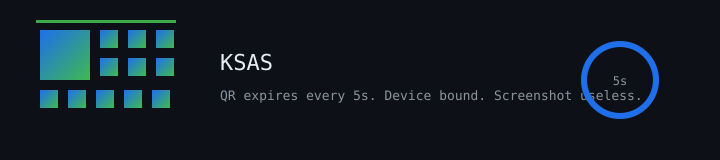

# KSAS

Attendance fraud is a real problem at universities. KSAS closes the obvious holes: short-lived QR codes, device binding, and a multi-layer check on every scan. Built for Kabarak University.

## How check-in works

1. Lecturer starts a session and displays a live QR code.
2. The QR refreshes every 5 seconds with a one-time token.
3. Student scans. The system checks device fingerprint, enrollment, optional GPS, and optional campus IP.
4. Attendance is recorded. Screenshots of old codes fail.

## Roles

**Students** see per-course percentages, trends, and class averages. Feedback is anonymous.

**Lecturers** watch check-ins land in real time, get risk alerts below 75%, and export CSV.

**Admins** manage users, courses, school codes, and archived sessions.

## Stack

React 19, TypeScript, Vite, Tailwind CSS, Firebase.

## Run locally

    npm install
    npm run dev

## License

MIT
